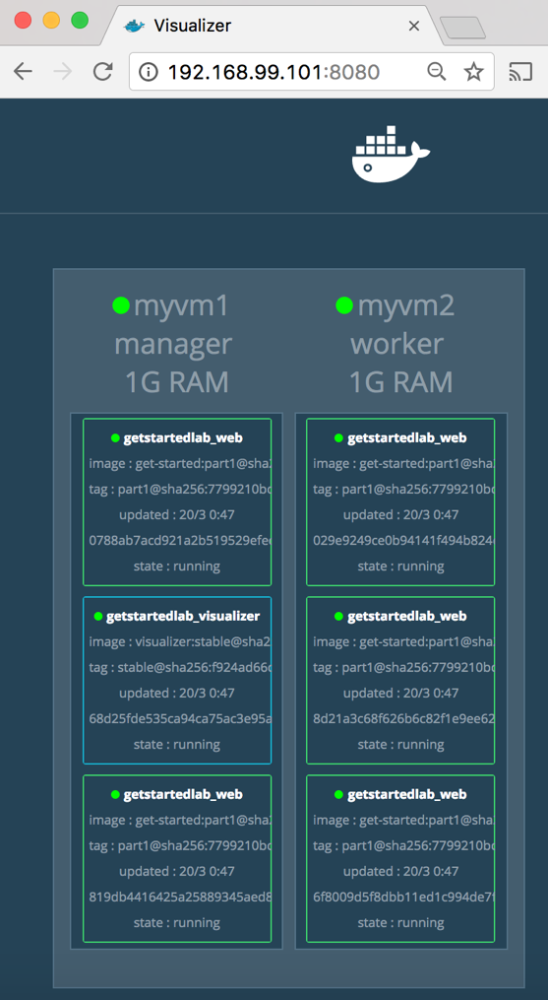
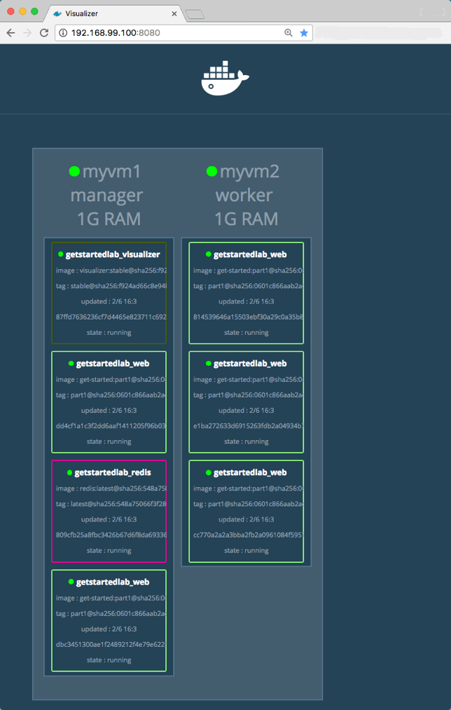

# 第五部分 - 栈

## 前提条件

* 已安装 Docker \(1.13+\)
* 已安装 [Docker Compose](https://docs.docker.com/compose/overview/) 
* 已安装 [Docker Machine](https://docs.docker.com/machine/overview/) 
* 已完成 第一部分 的阅读
* 已完成 第二部分 的阅读
* 已将 friendlyhello 镜像上传至仓库. 我们在后续需要使用这个共享镜像
* 已将镜像作为已部署的容器运行
* 与 第三部分 相同的 `docker-compose.yml`
* 已按照 第四部分 教程部署了主机. 可通过 `docker-machine ls` 命令验证
* 已按照 第四部分 教程部署了集群. `docker-machine ssh myvm1 "docker node ls"` 命令校验. 如果集群已经正常运行, 节点的状态均为 `ready` 状态, 否则需要重新初始化集群并将工作主机加入至集群中

## 简介

在 第四部分 , 你学会了如何搭建集群, 它们运行 Docker 并在其上部署应用, 容器在多台主机上协同运行.

在 第五部分 , 你已经到达了分布式应用的最顶层: **栈** . 栈是一组互相关联的应用, 他们共享依赖的环境, 并且可以被同时部署和扩展. 单个栈可以定义和协调整个应用的功能 \(虽然复杂的应用可能需要多个栈\).

在 第三部分 创建 Compose 文件并运行 `docker stack deploy` 的时候, 你已经使用了栈了. 但这个栈只有一个服务运行在一个主机上, 通常这不会在生产环境使用. 现在你可以学习如何构建互相依赖的多个服务并且让他们在不同的主机上运行

## 增加新的服务并重新部署

在 `docker-compose.yml` 文件上增加服务是非常简单的. 首先, 新增一个免费的监控服务, 让我们能够查看堆栈是如何调度容器的.

打开 `docker-compose.yml` 并按如下内容修改. 注意将 username/repo:tag 替换为你的镜像.

```yaml
version: "3"
services:
  web:
    # replace username/repo:tag with your name and image details
    image: username/repo:tag
    deploy:
      replicas: 5
      restart_policy:
        condition: on-failure
      resources:
        limits:
          cpus: "0.1"
          memory: 50M
    ports:
      - "80:80"
    networks:
      - webnet
  visualizer:
    image: dockersamples/visualizer:stable
    ports:
      - "8080:8080"
    volumes:
      - "/var/run/docker.sock:/var/run/docker.sock"
    deploy:
      placement:
        constraints: [node.role == manager]
    networks:
      - webnet
networks:
  webnet:
```

文件内添加了一个新的服务, 名叫 `visualizer` . 注意其中两个新的属性: 

* volumes - 使 `visualizer` 服务能够访问 Docker 的主机套接字文件
* placement - 使 `visualizer` 服务只能运行在群控制器内

这是因为这个容器是通过 [Docker 开源项目](https://github.com/ManoMarks/docker-swarm-visualizer) 构建的, 它通过图标展示了 Docker 服务在集群中的运行状况.

确保你的终端已经连接到 `myvm1` , 运行 `docker-machine ls` 命令罗列主机, 如果有必要, 可以重新运行 `docker-machine env myvm1` 命令, 并运行以下命令:



```bash
eval $(docker-machine env myvm1)
```



```bash
& "C:\Program Files\Docker\Docker\Resources\bin\docker-machine.exe" env myvm1 | Invoke-Expression
```



重新在群管理器运行 `docker stack deploy` 命令, 并且更新任何需要更新的服务:

```bash
$ docker stack deploy -c docker-compose.yml getstartedlab
Updating service getstartedlab_web (id: angi1bf5e4to03qu9f93trnxm)
Creating service getstartedlab_visualizer (id: l9mnwkeq2jiononb5ihz9u7a4)
```

在 Compose 文件中, `visualizer` 在端口 8080 运行. 通过 `docker-machine ls` 命令获取其中一个节点的 IP 地址. 访问该 IP 的 8080 端口可以看到 `visualizer` 已经运行了:



`visualizer` 已经如预期般地运行在群管理器上, 并且五个 `web` 服务实例分布在集群当中. 你可以通过 docker stack ps &lt;stack&gt; 命令验证页面的结果:

```bash
docker stack ps getstartedlab
```

`visualizer` 是一个独立的服务, 它可以运行在栈内的任何服务内, 而不需要任何依赖. 现在我们要创建一个不需要任何依赖的服务: 提供访问者计数器的 `Redis` 服务.

## 保存数据

* 让我们再次按照刚才的流程增加一个 Redis 数据库, 用来保存应用的数据.

打开 `docker-compose.yml` 并按如下内容修改. 注意将 username/repo:tag 替换为你的镜像.

```yaml
version: "3"
services:
  web:
    # replace username/repo:tag with your name and image details
    image: username/repo:tag
    deploy:
      replicas: 5
      restart_policy:
        condition: on-failure
      resources:
        limits:
          cpus: "0.1"
          memory: 50M
    ports:
      - "80:80"
    networks:
      - webnet
  visualizer:
    image: dockersamples/visualizer:stable
    ports:
      - "8080:8080"
    volumes:
      - "/var/run/docker.sock:/var/run/docker.sock"
    deploy:
      placement:
        constraints: [node.role == manager]
    networks:
      - webnet
  redis:
    image: redis
    ports:
      - "6379:6379"
    volumes:
      - "/home/docker/data:/data"
    deploy:
      placement:
        constraints: [node.role == manager]
    command: redis-server --appendonly yes
    networks:
      - webnet
networks:
  webnet:
```

在 Docker 源里有一个 Redis 官方镜像, 并且允许使用短的镜像名 `redis` , 因此不需要使用 username/repo 的表示法. Redis 的服务端口是预先定义好的 6379 , 在我们的 Compose 文件内, 我们将这个端口直接暴露, 因此你可以在 Redis 桌面管理器中直接输入任意节点的IP地址来管理这个 Redis 实例.

最重要的是, Redis 镜像的两个配置使得数据能够在堆栈的部署内保持不变:

* redis 镜像总是运行在群管理器节点上, 因此它一直使用着同一套文件系统
* redis 访问容器内的 `/data` 目录, 对应可以直接访问主机文件系统的 `/home/docker/data` 目录

以上配置, 在你的主机物理文件系统内创建了 Redis 的真实数据. 否则, Redis 会将数据保存在容器文件系统内的 /data 目录下, 在容器被重新部署的时候, 这个目录会被删除.

Redis 服务配置有以下两个参数:

* `placement.constraint` - Redis 服务所部署的位置, 确保它一直使用同一个主机
* volumes - 使容器内访问 `/data` 可以直接访问 主机的 `/home/docker/data` . 当容器发生变化的时候, 保存在容器内的文件可以被持久化保存在主机上

你现在已经部署了一个使用 Redis 服务的栈了.

* 在集群管理器内创建 `./data` 目录

```bash
docker-machine ssh myvm1 "mkdir ./data"
```

* 确保你当前的终端已配置为与 `myvm1` 通讯.
  * 运行 `docker-machine ls` 来罗列所有的机器, 并且确保你已经连接上 `myvm1` .
  * 如果有必要, 可以重新运行 `docker-machine env myvm1` , 并运行打印出的命令来配置终端.



```bash
eval $(docker-machine env myvm1)
```



```bash
& "C:\Program Files\Docker\Docker\Resources\bin\docker-machine.exe" env myvm1 | Invoke-Expression
```



* 再一次运行 `docker stack deploy` 

```bash
docker stack deploy -c docker-compose.yml getstartedlab
```

* 运行 `docker service ls` 来验证三个服务是否正在按期望地运行.

```bash
$ docker service ls
ID                  NAME                       MODE                REPLICAS            IMAGE                             PORTS
x7uij6xb4foj        getstartedlab_redis        replicated          1/1                 redis:latest                      *:6379->6379/tcp
n5rvhm52ykq7        getstartedlab_visualizer   replicated          1/1                 dockersamples/visualizer:stable   *:8080->8080/tcp
mifd433bti1d        getstartedlab_web          replicated          5/5                 gordon/getstarted:latest        *:80->80/tcp
```

* 检查其中一个节点的网页, 例如 `http://192.168.99.101` , 可以看到访问者的计数已经实时更新并且保存至 Redis 内了. 


 同时, 检查任意节点 8080 端口上的 `visualizer` 服务, 可以发现 `redis` 服务已经和 `web` 以及 `visualizer` 服务 一起运行了. 




