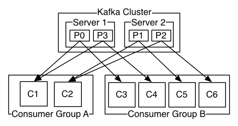

# 简介

阿帕奇 Kafka 是一个分布式流处理系统

一个流处理系统主要有三个能力:

1. 发布和订阅记录流, 类似于消息队列和企业邮件系统
2. 以容错-持久地方式存储记录流
3. 当记录流出现时处理它

Kafka通常用于以下两种应用:

1. 在系统或应用之间构建一个能够可靠地获取实时数据流地管道
2. 构建一个实时流应用能够转换或响应数据流

为了能够理解Kafka究竟是如何实现的, 让我们从最底层了解它的能力.

首先让我们定义以下几个概念:

* Kafka 可以作为集群应用在一个或多个数据中心服务器上
* Kafka 集群可以将记录流以 "topic" \( 主题 \) 的形式按分类存储
* 每个记录通过 键, 值, 时间戳 来存储

Kafka有四类核心API:

* 生产者API - 允许应用在一个或多个主题上发布记录流
* 订阅者API - 允许应用在一个或多个主题上订阅, 并处理发布给他们的记录流
* 流API - 允许应用作为流处理者, 消费一个或多个主题上的输入流, 并向一个或多个主题生产输出流, 能有效地将输入流转换为输出流
* 连接器API - 允许构建并运行可重用的生产者或消费者, 通过连接Kafka的主题至已存在的应用或数据系统. 例如, 连接相关数据库的连接器会捕捉数据表的每一次改变.

Kafka的客户端和服务器是通过一种简单, 高效, 语言无关的TCP协议来进行连接的. 这种协议已经进行版本控制, 并且向下兼容. 我们提供了Java版本的Kafka客户端, 不过同样有很多别的语言地客户端可以使用.

## 主题和日志

让我们深入理解记录流地核心概念 - 主题.

主题是推送记录的分类. 在Kafka内, 主题经常有多个订阅者. 这意味着, 主题可以有零到多个消费者在订阅写入主题地数据.

对于每个主题, Kafka集群会维护一个分区日志:

每个分区都是一个有序的, 不可变的记录序列, 这些记录不断被追加到一个结构化的提交日志中. 分区中的记录都被分配了一个名为偏移量的顺序 id , 该偏移量唯一标识分区中的每个记录.

Kafka在一个可配置的保留周期内持久地保存所有已发布地记录, 无论它们是否已经被消费. 例如, 保留周期设置为两天, 则在发布记录后的两天内, 它可供使用, 之后将被丢弃以释放空间. Kafka的表现是跟数据大小无关的, 因此可以长时间存储大量数据.

事实上, 每个消费者基本上只保存自身在日志内的偏移量或位置的元数据. 这个偏移量被消费者控制: 一般情况下, 消费者会线性地增加它的偏移量, 但事实上, 因为它的位置被消费者控制, 消费者可以按照任意顺序进行消费. 例如一个消费者可以重置为早先的偏移量, 来重新处理过去的数据, 或者可以跳到最新的记录, 并从 "现在" 开始消费.

这种功能的组合意味着Kafka的消费者非常的轻量. 这使得消费者的加入和退出, 对集群和其他消费者的影响非常小. 例如, 你可以使用我们的命令行工具来"跟踪"任意主题的内容, 而不需要修改任何正在运行的消费者.

日志的分区有多种用途. 首先, 它允许日志扩展到指定的大小来匹配单一的服务器. 每个独立的分区必须适合承载它的服务器, 不过一个主题可能拥有多个分区, 因此它可以处理任意数量的数据. 其次, 他们可以作为平行单位, 而不是独立的一份.

## 分布式

日志的分区分布在Kafka集群中的服务器上, 每个服务器处理数据和对分区份额的请求. 为了实现容错, 每个分区都在可配置的服务器数量之间进行复制。

每个分区都有一个主服务器和零至多个副服务器. 主服务器负责处理所有对分区的读写请求, 副服务器则被动地复制主服务器的行为. 如果主服务器不可用, 其中一个副服务器将自动变成新地主服务器. 每个服务器对于自己的日志分区而言, 将作为主服务器, 对于其他分区, 则作为副服务器, 因此在集群中, 负载将会很好的被分摊.

## 异地备援

Kafka的镜像制作向集群提供了异地备缓功能. 通过镜像制作, 消息可以在多个数据中心或云块复制. 通过主动或被动的存储方案, 你可以使用这些消息来为备份和恢复; 亦或者, 你可以将数据保存在更靠近用户的地方, 或者提供与位置相关的数据.

## 生产者

生产者主要负责将数据推送至所选的主题. 他负责决定记录所要保存的主题分区. 这可以通过流行的简单调度轮询算法来进行负载均衡, 或可以通过别的语义分区算法 \( 语义指的是基于记录的关键词 \). 

## 消费者

消费者通过组名来为自身分组, 每个推送到主题的记录, 都将被交付给正在订阅该主题的消费者组中的一个消费者实例. 消费者可以是独立的进程或位于独立的服务器中.

如果所有的消费者都在同一个消费者组内, 记录会有效均衡地发送至消费者实例.

如果所有的消费者实例都在不同的消费者组内, 那么每个记录都将会被广播给所有的消费者进程.

拥有两个服务器的Kafka集群承载这四个分区 \( P0 - P3 \), 并有两个消费者组. 组A有两个消费者实例, 组B有四个.

然而, 更常见的情况是, 每个主题拥有少量的消费者, 每个主题有一个"订阅者". 每个组由多个消费者构成, 有利于弹性伸缩和提高容错率. 使用消费者集群作为订阅者, 而不是单一进程, 对生产-消费模式而言再合适不过了.

在Kafka内, 消费的实现方案是通过为消费者实例分割日志分区, 因此每个实例都能公平地在任何时间独享分区. 组内地成员关系是通过Kafka的协议动态管理的. 如果新消费者实例加入一个组, 新的实例会从别的组内成员那里获取分区, 如果实例不可用, 它的分区将会被分发给剩余的消费者实例.

Kafka只提供记录在分区内顺序, 而不会提供同一主题中不同分区的顺序. 对于大多数应用而言, 通过键值获取分区地数据和对每个分区的排序已经足够使用. 然而, 如果需要对所有记录获取顺序, 可以只为主题分割一个分区来实现, 然而这意味着只有一个消费者组内只有一个消费者.

