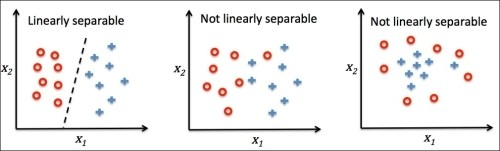

# 感知机\(Perceptron\)

## 定义

感知机是一种相对而言非常简单易懂的机器学习模型, 主要用于二项分布的逻辑问题, 例如判断是否为垃圾邮件, 判断病人是否罹患恶性肿瘤等. 它也被称之为**线性分类器\(Linear Classifier\)**.

我们假设样本的每个特征值x都有一个权重值w, 这个权重值决定了这个特征值对于最后的结果是否起了作用, 并且是起了正作用还是负作用. 将每个权重值和特征值的乘积累加, 并与一个阈值t比较. 若大于阈值, 则输出值y=+1, 若小于阈值, 则输出值y=-1, 这便是感知机函数P:

$$
y 
= P(x_1, x_2, ... , x_n) 
= Sign(\sum_{i=1}^nw_ix_i - t)
$$

为了简化感知机函数, 我们假设阈值t为一个特殊的w0, 并假设x0=1, 由此感知机函数为:

$$
y = Sign(
\sum_{i=0}^nw_ix_i
)
= Sign(W^TX)
$$

我们可以想象, 在二维平面内, 感知机函数, 也即是由y=0的点所组成的几何图形为一条直线, 在三维空间内, 为一个平面, 在n维空间中, 则为一个超平面. 在线或平面的一测, 感知机函数的取值唯一, 我们将取值为+1的区域称之为正区域, 取值为-1的区域称之为负区域.

## 感知机学习算法\(Perceptron Learning Algorithm\)

感知机学习算法是一种求解感知机函数最优解的学习算法, 它非常得朴素. 但同时也存在着自己的局限性.

**首先我们设置感知机的权重向量W的初始值为零向量, 再按照固定顺序将样本X代入感知机函数中, 若输出值与期望值不同, 则优化权重向量W, 再从头开始将样本按固定顺序代入, 直至所有样本都不会产生错误的输出值.** 

这个算法非常简单明了, 但存在两个问题:

1. 我们这个优化过程一定能结束吗? 
2. 我们如何优化权重向量W才是有效的?

对于第一个问题, 我们可以很明确地回答你: 不一定能结束. 感知机学习算法对于样本有着严格的要求, 其必须能够被线性可分. 也即是在几何上, 正样本和负样本一定要能够被直线或平面分隔.  下图只有左侧的样本集满足线性可分的要求.

而我们该如何优化权重向量W, 才能让感知机函数不断变好, 最终达到能够分隔样本的目标呢?

我们假设在一个平面内, 感知机函数代表了一个直线. 通过向量几何知识可以得知, 权重向量W即为感知机函数的法向量, 且指向了正区域. 

当我们代入样本后, 样本的输出值期望为+1, 而我们却输出了-1, 说明样本所代表的点在负区域, 点的向量与直线的法向量夹角很大. 因此我们希望这个夹角能小一点. 

同理, 当我们代入样本后, 样本的输出值期望为-1, 而我们却输出了+1, 说明样本所代表的点在正区域, 点的向量与直线的法向量夹角很小, 我们希望这个夹角能大一点.

由向量加减运算的几何知识可以得知, 两个向量相加所得的向量, 与两个向量的夹角将会变小, 两个向量相减所得的向量, 与减向量的夹角会变大. 因此我们可以得出以下优化权重向量W的算法:

$$
W_{(t+1)} := W_t + yX
$$

其中y为**样本的真实值**. t代表着第t次优化.

## 收敛性

我们通过几何可以直观地感受到, 对于线性不可分样本集, PLA算法是不可能找到合理的权重向量的. 虽然我们知道线性可分的样本集一定存在最优的权重向量, 但是PLA算法一定能找到它吗? 这并不明显, 需要我们做进一步的证明.

通过点到超平面的距离公式:

$$
\frac
{|W^TX+b|}
{\Vert W \Vert}
$$

我们假设空间中样本所代表的点到原点的最大距离为R, 到超平面的最小距离为γ, 最优的权重向量为Wk, 最多运行k次, 便能得到最优的权重向量, 我们可以得知以下不等式:

$$
\gamma = 
\frac{min(yW_k^TX)}
{\Vert W_k \Vert}
$$

$$
y_iW_k^TX_i 
\ge 
min(yW_k^TX)
\gt
0
$$

$$
\frac{y_iW_k^TX_i}
{\Vert W_k \Vert}
\ge \gamma
\gt 0
$$

$$
W_k^T \cdot W_k
= 
W_k^T  \cdot (W_{(k-1)} + y_aX_a)
\ge
W_k^T  \cdot W_{(k-1)} + min(yW_k^TX)
$$

通过k次迭代后:

$$
W_k^T \cdot W_k
= \Vert W_k \Vert^2
\ge k \gamma \Vert W_k \Vert
$$

$$
\Vert W_k \Vert \ge k\gamma
$$

又由向量相加的几何性质可以得知:

$$
\Vert W_k \Vert^2 = 
\Vert W_{(k-1)} + y_aX_a \Vert^2 
\le 
\Vert W_{(k-1)} \Vert^2  + \Vert y_aX_a \Vert^2 
= 
\Vert W_{(k-1)} \Vert^2 + R^2
$$

通过k次迭代后:

$$
\Vert W_k \Vert^2 \le kR^2
$$

$$
\sqrt{k}R \ge \Vert W_k \Vert \ge k \gamma
$$

最后可以推导出:

$$
k \le (\frac{R}{\gamma})^2
$$

由此可以证明, 在一定次数下, 且样本线性可分, 则PLA算法一定能找到最优的权重向量W.

## 局限性

感知机学习算法有很多限制, 除了需要样本线性可分, 还无法确定权重向量到底需要进行多少次修正. 通过收敛性推导的公式我们虽然知道, 线性可分的样本一定能找到最优权重向量, 但其中γ是需要确定最优权重向量才能得到, 这就陷入了循环论证.

