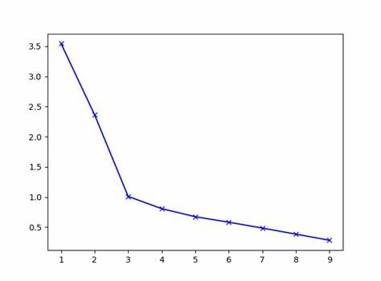

# K均值聚类\(K-Means\)

K-Means聚类算法是非常流行的一种无监督学习算法, 它原理简单且易于实现. 同时能够在后续持续增加训练集数据的情况下, 高效地更新模型. 这种聚类算法认为, 在以各个特征为轴的多维特征空间中, 每个样本都可以用空间中的点表示, 越相似的样本在空间中的距离越近, 反之越不相似的样本在空间中的距离越远. 因此, 当我们所有的样本仅有K种类型的时候, 每个样本应该都有且仅属于某一种类型, 属于同一种类型的样本应该在空间中彼此靠近.

## 设置K值

K-Means算法需要在进行训练时, 需要预先设置分类的个数, 即K值. 不同的K值对训练结果有严重的影响. 一般情况下, 需要我们结合问题的现实情况以及训练集的采集情况做一个较为合理的预估.

## 随机选取簇类中心

当我们人为设定好K值后, 我们就期望K-Means算法能够将训练集的数据分隔成多份, 我们称每一份数据为**簇\(Cluster\)**. 同时每个簇都会有一个中心, 称为**簇类中心\(Cluster centriod\)**. 

一开始的时候, 我们并不知道该如何分隔各个簇, 也不知道每个簇的中心在什么地方. 因此我们可以随机选取样本集中的K个样本, 作为簇类中心, 我们用**符号μ**来表示簇类中心点在特征空间中的向量, 用**符号c**来表示簇类中心点的序号.

$$
M_c = \{ \mu_i^{(c)}  | 1 \le i \le n\}
$$

$$
M_c = 
\left [
\begin{matrix}
\mu_1^{(c)}\\
\mu_2^{(c)}\\
...\\
\mu_n^{(c)}
\end{matrix}
\right ]\\
$$

## 簇类分配

为每个簇类随机分配簇类中心之后, 我们便可以为每个样本分配簇类. 通过与每个簇类中心进行特征空间距离的比较, 我们可以找到与样本最靠近的簇类中心, 并为其分配簇类:

$$
c^{(i)} := index(minimize \Vert X^{(i)} - M_c \Vert)
$$

其中c为样本i所归属的簇类序号.

## 调整簇类中心

当我们为每一个样本分配簇类后, 我们便可以重新设定簇类中心的位置了. 将属于同一个簇类的样本的各项特征值累加取平均, 变能够算得样本的中心点, 也即是该簇类新的中心.

$$
M_c
:=
\frac{1}{m_c}
\sum_{i=1}^{m_c}X_i^{(c)}
$$

其中mc为簇类c中的样本个数. 得到新的簇类中心后, 不断重复簇类分配和调整簇类中心的步骤, 便可以不断优化簇类中心的位置. 最终, 当每个簇类中心的位置不再改变后, 我们便得到了簇类中心的局部最优解. 有此可以对未知的样本进行预测.

## 局部最优解

对于K-Means算法而言, 虽然我们能够保证, 在不断进行簇类分配和调整簇类中心的动作下, 我们总能找到K个簇类中心, 他们会最终稳定到一个点不会再随着改变, 也就是K-Means算法一定能收敛到一个最优解. 但是这个最优解有可能只是局部的. 

尤其是对于那些仅为个位数的K值, 以及大量样本的情况, 非常有可能会掉入局部最优解. 对于这种情况, 我们并没有太好的解决办法. 但是可以通过多次随机选取簇类中心并计算K-Means算法, 来找到最稳定的一组簇类中心.

## 损失函数

对于K-Means算法而言, 损失函数并不是必须的, 因为动态的簇类分配和调整簇类中心已经能够确保获得局部最优解. 但是我们仍然可以定义损失函数, 并对所得的簇类中心进行评估. 我们定义每个簇内的样本到簇类中心的距离的平均值, 即为K-Means算法的损失函数:

$$
J(X, M)
=
\frac{1}{m}
\sum_{i=1}^m
\Vert
X^{(i)} - M_c
\Vert^2
$$

## 肘部法则

对于如何设置一个正确的K值, 事实上并没有一个特别好的自动化方案. 需要我们手动设置, 并通过作图来观察. 我们以K值作为X轴, 损失函数J的值作为Y轴. 当K值不断增大时, 损失函数的值一定会逐渐随之减少, 直到K值与样本的个数相同, 则损失函数J等于0. 当K值比最优的K值小时, 损失函数J的值有可能会下降地稍快, 直到到达了, 当K值比最优的K值大时, 损失函数J的值则会平缓地减少. 因此在最优的K值上, 会形成一个类似人手肘部的形状. 我们可以较大程度上推测, 这是最优的K值.

如上图所示, 在K=3上的点便是曲线的"肘部", 我们可以比较自信地推测, 这是最优的K值. 但是事实上, 这种通过肉眼观察的方式并不是总能凑效. 因为曲线有可能并没有一个明显的"肘部".

