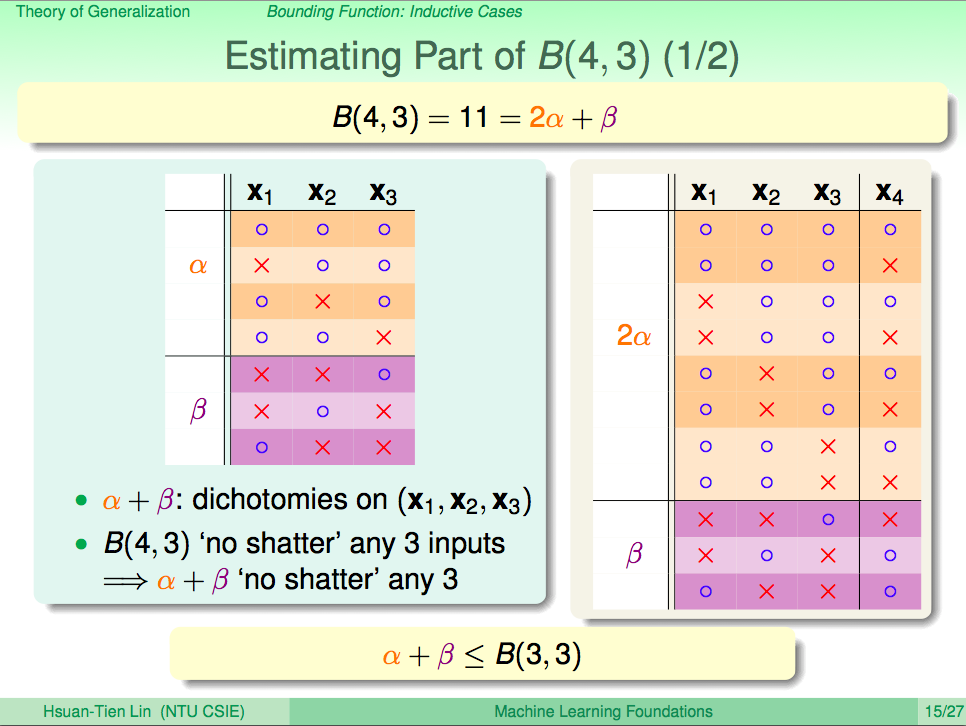

# 可行性

## 有限大小的函数集合

我们知道, 机器学习本质上是通过已知去求解未知的各种手段, 那这些手段真的可行嘛? 我们真的能通过一些小部分的样本和一些理论运算, 就能够对所有可能样本的结果进行预测吗? 我们可以很明确地回答你: **我们不能对所有可能样本的结果进行准确预测, 但是我们能做到大概近似的\(PAC\)预测**. 这需要我们通过概率的角度去证明机器学习的可行性.

假设有一个非常巨大的袋子, 袋子内装着人类根本数不完的玻璃珠, 玻璃珠只有两种颜色, 绿色和橘色**.** 现在需要对袋子内, 绿色玻璃珠的占比进行预测. 这是一个经典的统计学采样问题. 

我们**独立随机地**从袋子里面拿出M个玻璃珠, 则可以假设, 这M个玻璃珠的绿色占比, 和袋子内所有的玻璃珠的绿色占比**大概近似**.  这一定是真的嘛? 很遗憾这种大致相等是有可能错误的. 但是幸运地是, 这种错误的概率是能够控制的.

假设袋子内绿色玻璃珠的占比的值为μ, 我们手上M个玻璃珠中绿色玻璃珠的占比为ν, 则他们差值的绝对值超过某个数ε的概率不会大于一个固定值:

$$
P[|\mu - \nu| \gt \epsilon] \le 2e^{(-2 \epsilon^2 M)}
$$

上述不等式是经过严格证明的, 称为霍夫丁不等式\(Hoeffding inequality\), 它向我们揭示了一个规律: 只要我们独立随机地采集足够多的样本, 我们就能确保通过样本对整体的预测足够可信.

而在机器学习上, 假设在M个带了标签的随机样本下, 通过某种训练方法, 获得了某个目标函数h. 设这个函数h在样本上的错误率为Ein, 在所有的样本上的错误率为Eout, 只要函数h固定不变, 那么他们同样满足霍夫丁不等式:

$$
P[|E_{in}(h) - E_{out}(h)| \gt \epsilon] \le 2e^{(-2 \epsilon^2 M)}
$$

因此, 只需要找到一个函数h, 他在M个样本内的错误率Ein足够小, 且样本的数量M足够大, 就可以说, 函数h在样本之外的错误率Eout与Ein大致近似, 函数h就能够很好地拟合未知的样本.

然而到此我们仅证明了一半的可行性. 机器学习是在一个目标函数集合H内寻找到理想的目标函数h, 因此, 函数集H越大, 在挑选错误率最小的函数时, 越容易因为样本存在的倾斜而选择了一个不好的函数. 由于证明过长, 我们直接给出结论:

$$
P[|E_{in}(h) - E_{out}(h)| \gt \epsilon] \le 2Ne^{(-2 \epsilon^2 M)}
$$

其中N为函数集合H的大小. 由此可以得到结论, 在有限的函数集H内, 通过足够大的样本M, 我们是可以通过已知求解未知的.

## 无限大小的函数集合

然而我们很快发现, 我们处于一个进退两难的困境. 由于我们不可能事先知道任意函数集合H内, 是否包含想要找到理想的目标函数h. 若将函数集H约束在一个很小的范围内, 则很大概率目标函数h根本不在函数集内, 我们所有后续的动作都是在做无用功. 若将函数集合H设置地非常大. 则找到的目标函数h越不可信.

理论上来说, 目标函数集合H的大小N可以取到无穷大. 即使在现实中的绝大部分情况下, 目标函数h可以通过先验的领域知识进行约束, 但即使将其限制为一次函数, 它依然有无限种可能. 然而非常幸运地是, 函数集H的大小N以及样本数量M是存在一定的制约关系的. 

## 分类问题的可行性

我们以分类问题为例, 对于M个样本而言, 函数可以根据样本的分类结果分成最多2的M次方种类型. 每种相同分类结果的函数我们称之为是同一种分类器:

在上图Margin这个范围内, 可以有无数条互相平行的直线, 这些直线都能将样本进行相同的分类, 他们可以被认为是同一种分类器, 我们从最直观的经验就能看出, 在Margin正中间的直线, 便是这一种分类器当中最优的那个. 即使我们在同一种分类器中随机挑选一个分类器, 我们也可以对无穷大的M进行一定的约束. 

### 打散\(shatter\)

对于某一个函数集合H和M个样本而言, 若函数集合能被够区分出2的M次方种分类器, 则称函数集合将样本全部打散了. 或者说函数集合内的函数, 将样本的二项分布穷举了, 则称函数集合将样本打散了.

### 成长函数\(Growing Function\)

我们假设存在一个成长函数g, 它代表了函数集合H, 在样本M下, 最多能区分多少种分类器:

$$
N
 \le g_H(M) \le 2^M
$$

但目前成长函数还是太大了, 并不能将霍夫丁不等式限定在一个可接受的范围内. 既然如此, 我们尝试从分类器的角度出发, 看是否能发现分类器与成长函数之间的关系.

### 分类器

对于分类问题而言, 我们最直观的目标, 便是寻找到一个能够有效区分样本的分类器. 在二维平面上, 分类器可以是一条直线, 可以是一条曲线, 还可以是一个多边形. 因此在最开始, 我们需要挑选一种合适的分类器, 这便需要我们通过先验的领域知识进行挑选. 

#### **非凸多边形**

非凸多边形理论上可以模拟出任意形状, 因此若以非凸多边形作为分类器, 我们最多可以获得2的M次方种分类器. 但这种分类器的可能实在是太多了, 对函数集合大小N的约束实在太小了. 因此我们可以得出结论, **以非凸多边形进行分类的机器学习是不可行的**.

#### **凸多边形**

对于M个样本而言, 若我们将他们都分布在一个圆上, 则同样可以获得2的M次方种分类器. 因此, **以凸多边形进行分类的机器学习是不可行的**.

#### **直线**

当我们以直线作为分类器时, 可以很容易发现, 成长函数g并不能伴随着样本个数M而指数上升, 当样本个数到达了一个未知的阈值后, 便不能再持续地以指数级增加了. 因此, **从普遍的角度来说: 以某些形状进行分类的机器学习可能是可行的**.

### 约束函数\(Bounding Function\)

我们将这个关于样本个数的未知阈值称之为**断点值k \(Break Point\)**. 要获得具有一般性的结论, 我们先抛开分类器具体的形状, 让我们从有断点值k的分类器出发, 定义一个约束函数B:

$$
N
 \le g_H(M) \le B(M, k) \le 2^M
$$

以下为约束函数的值与M和k的关系:

| B\(M, k\) | k=1 | k=2 | k=3 | k=4 | k=5 | k=6 |
| :--- | :--- | :--- | :--- | :--- | :--- | :--- |
| M=1 | 1 | 2 | 2 | 2 | 2 | 2 |
| M=2 | 1 | ≦3 | 4 | 4 | 4 | 4 |
| M=3 | 1 | ≦1+3=4 | ≦7 | 8 | 8 | 8 |
| M=4 | 1 | ≦1+4=5 | ≦4+7=11 | ≦15 | 16 | 16 |
| M=5 | 1 | ≦1+5=6 | ≦5+11=16 | ≦11+15=26 | ≦31 | 32 |
| M=6 | 1 | ≦1+5=7 | ≦6+16=22 | ≦16+26=42 | ≦26+31=57 | 63 |

由断点值k的性质可以得知: 

当M等于k时, 我们无法取到2的M次方, 因此可以得知:

$$
B(M,k) \le 2^M - 1
$$

当M小于k时, 我们总能穷举M所有的排列组合, 因此:

$$
B(M,k) \le 2^M
$$

当M大于k时, M中任意的k个样本, 不能被k打散, 否则不满足断点k的要求. 我们取任意其中一个样本i, 并找到这么α对M个样本的排列组合: 他们除了第i个样本的结果标签可以不同外, 别的样本的结果标签都要相同, 剩余的样本数量我们标记为β, 如下图所示:

在橙色区域, 除了x4, 其余的x1, x2, x3 均成对相同, 在紫色区域, x1, x2, x3的排列组合都和橙色区域的不同, 否则会和紫色区域的排列组合重复, 应该被预先剔除掉. 那么对于任意的约束函数B, 都可以表示为:

$$
B(M, k) = 2\alpha + \beta
$$

我们首先观察在橙色区域的α种排列组合下, 他们不能够被k-1打散, 否则加上已经全排列的第i个样本, 也就是上图的x4, 则必然已经被k打散. 因此:

$$
\alpha \le B(M-1, k-1)
$$

同样的, 对于排除了第i个样本剩余的M-1个样本而言, 他们不能被k打散, 而由上述定义可以得知:

$$
\alpha + \beta \le B(M-1, k)
$$

由此我们可以得到约束函数B上限的递推形式:

$$
B(M, k) \le B(M-1,k) + B(M-1,k-1)
$$

由上述的递推公式, 我们可以推导出, 约束函数B, 在M远大于k的时候, 被一个多项式函数约束, 且其最最大项为m的k-1次方:

$$
B(M, k) \le \sum_{i=0}^{k-1}
\left (
\begin{matrix}
M \\
i \\
\end{matrix}
\right )
$$

### VC约束\(Vapnik-Chervonenkis bound\)

经过上述的约束函数, 再通过一系列非常需要技巧的数学推导, 我们可以在N远大于k的时候, 为霍夫丁不等式推导出一个更加具有指导意义的边界, 称之为VC约束或VC边界:

$$
P[\exists h \in H s.t. |E_{in}(h) - E_{out}(h)| \gt \epsilon] \le 4m_H(2M)e^{(-\frac{1}{8} \epsilon^2 M)}
$$

当断点大于等于3, 且M足够大时, 我们可以用一个更加简单的上限表示:

$$
P[\exists h \in H s.t. |E_{in}(h) - E_{out}(h)| \gt \epsilon] \le 4(2M)^{k-1}e^{(-\frac{1}{8} \epsilon^2 M)}
$$

### VC维\(Vapnik-chervonenkis Dimension\)

在分类问题下, 对于我们的目标函数集合H而言, 我们知道它本质上代表了各种各样的分类器, 那么我们该怎么描述一个函数集合H总共包含了多少种分类器呢? 我们可以通过已知的断点k, 引入一个新的指标VC维度, 简称VC维.

简单得表述就是这个函数集合所能打散的最大样本数量.

