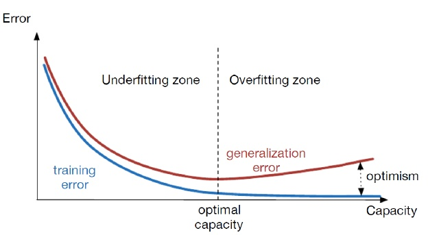

# 模型选择\(Model Selection\)

当我们在进行机器学习, 企图寻找到一个合适的模型, 来进行预测/分类/聚类的时候, 模型的选择就是我们无法绕过的一个问题. 我们的目标是在我们人为设定的一个函数集合H内, 找到最为合适的函数h. 但我们在设定一个函数集合的时候, 容易出现一个逻辑矛盾: **我们既然不知道最为合适的函数是什么样子的, 那怎么能够确保我们设定的函数集合包含这个目标函数**.

当我们进行模型训练的时候, 我们总是会企图收集更多的样本, 希望以此找到目标函数. 但往往在做无用功. 因为目标函数根本不在函数集合内.

为了解决这个问题, 我们可以通过**交叉验证**的方式, 寻找到合适的模型.

## 交叉验证\(Cross Validation\)

我们将训练集D切分成三份:

* 训练集D\(train\) - 60%
* 交叉验证集D\(cv\) - 20%
* 测试集D\(test\) - 20%

他们分别占据总的训练集D的一部分, 我们假设有三个模型需要我们进行选择:

$$
H_1 = 
\{ 
h | h(X) = \theta_0 + \theta_1x
\}\\
H_2 = 
\{ 
h | h(X) = \theta_0 + \theta_1x + \theta_2x^2
\}\\
H_2 = 
\{ 
h | h(X) = \theta_0 + \theta_1x + \theta_2x^2 + \theta_3x^3
\}
$$

要在这三个模型当中选择一个合适的模型, 需要按照以下步骤进行挑选验证.

### 训练

通过训练集D\(train\), 分别训练三个模型, 获得他们的参数集Θ

$$
minimizeJ(H_1, D^{(train)}) \to \Theta_1\\
minimizeJ(H_2, D^{(train)}) \to \Theta_2\\
minimizeJ(H_3, D^{(train)}) \to \Theta_3
$$

### 交叉验证

使用我们训练出来的参数集Θ与交叉验证集D\(cross validation\), 计算出各个模型的损失函数值:

$$
J(\Theta_1, D^{(cv)}) \to j_1^{(cv)}\\
J(\Theta_2, D^{(cv)}) \to j_2^{(cv)}\\
J(\Theta_3, D^{(cv)}) \to j_3^{(cv)}
$$

根据最小的损失函数值, 我们能够找到对数据拟合做好的模型与参数集合Θ.

### 测试

通过交叉验证之后, 找到的模型与参数集合我们并不能确保训练集和验证集的数据存在相同的倾向. 因此需要再进行一次测试:

$$
J(\Theta_1, D^{(test)}) \to j_1^{(test)}\\
J(\Theta_2, D^{(test)}) \to j_2^{(test)}\\
J(\Theta_3, D^{(test)}) \to j_3^{(test)}
$$

若测试出来的损失函数值依然符合验证的分布, 我们可以大概率地确保我们选择了一个相对正确的模型.

## 过拟合与欠拟合

通过交叉验证, 我们能够有效地找到合适的模型, 这个过程事实上就是在避免过拟合与欠拟合的发生. 假设我们有多个模型, 其中有的模型对应的函数次数过低, 函数集合H内, 并没有包含我们的目标函数, 这会导致欠拟合, 通常在训练集D\(test\)和交叉验证集D\(cv\)都会有很高的损失函数值且相似:

$$
j^{(test)} \approx j^{(cv)}
$$

我们假设有多个模型, 其中有的模型对应的的函数次数过高, 这回导致过拟合, 通常在训练集D\(test\)有较低的损失函数值, 在交叉验证集D\(cv\)则有较高的损失函数值:

$$
j^{(test)} \ll j^{(cv)}
$$

