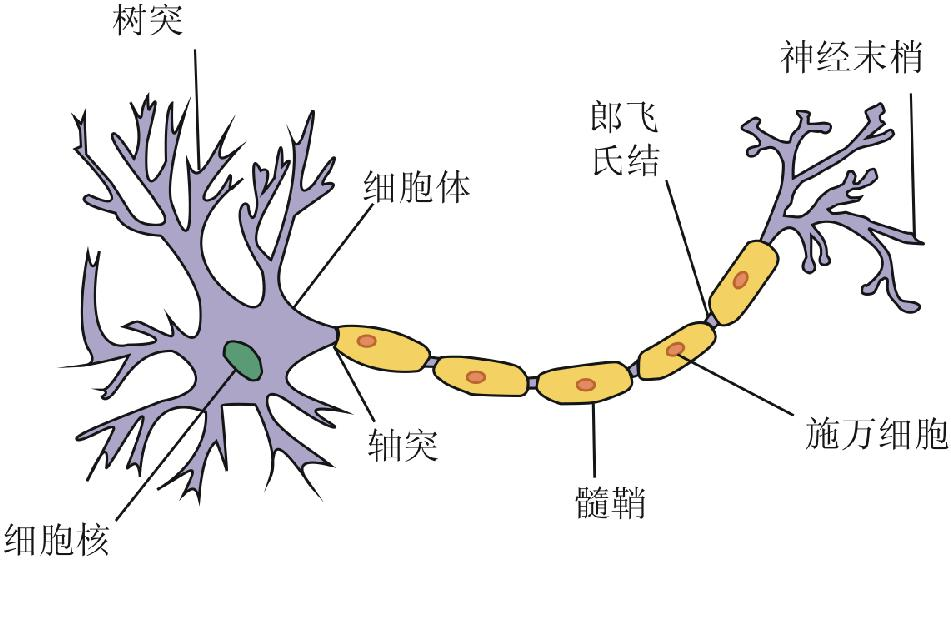

# 神经网络\(Neural Network\)

## 什么是神经网络

神经网络是一种尝试模仿人类大脑神经系统的算法, 它逐渐兴起于二十世纪八九十年代并受到广泛应用, 后续因为其偏大的计算量而沉寂过一段时间, 如今随着计算机运算能力的成长, 它再一次进入到我们的视野并且成为了一个十分有用的工具.

人类的大脑十分神奇, 它可以学习各种新的知识和技能. 和别的器官不一样, 人体的其他器官都存在具体的用途, 因此都在结构上进行了分化, 例如眼球能够感知光线, 肺部能够吸收氧气, 不过我们并不能通过眼球来呼吸, 也不能通过肺部来观察世界, 但是大脑可以!

科学家们在近代发现, 大脑不同部位会负责不同的工作, 这似乎意味着, "视觉"的脑区并不能替代"触觉"脑区, 我们的大脑里装着各种各样不同功能的脑区, 就像电脑里面运行着各种不同功能的程序一样. 

随后科学家们通过神经重接试验, 将视觉与触觉的感受器神经与脑区交换连接, 最终视觉脑区学会了"触觉", 触觉脑区学会了"视觉".

我们可以推断, 我们的大脑存在一种非常"高明"的认知机制, 这种认知机制能够模仿其他任何认知.我们推测, 这种认知机制是依靠无数个结构相对简单的神经元细胞间复杂的连接来实现的.

## 神经元

神经元是神经网络中的基础单位, 他主要包含了三个功能结构:

* 树突 - 接受神经电信号
* 细胞体 - 处理神经电信号
* 轴突 - 向另一个神经元传递神经电信号

这种神经元结构非常类似于

## 神经网络能做什么

神经网络算法是通过模仿神经元以及神经元间复杂的连接来实现的. 不过遗憾地是, 因为计算机运算能力的制约, 神经网络算法目前并不能真正地模仿大脑, 但是它为我们很好地解决了高维度特征向量的多项组合过多的问题.

在现实中, 我们面对的往往是高纬度的特征向量X, 且特征值之间可能存在交叉影响, 假设我们对一个特征向量维度为10的问题进行线性回归, 并且目标函数的次数为1, 则:

$$
h(X) = \theta_0 + \theta_1x_1 + ... + \theta_{10}x_{10}\\
+ \theta_{11}x_1x_2 + \theta_{12}x_1x_3 +  \theta_{13}x_1x_4\\
+ ... + \theta_{1024}x_1x_2x_3x_4x_5x_6x_7x_8x_9x_{10}
$$

仅仅特征向量维度n=10的线性回归问题, 当特征值之间存在交叉影响, 参数集合Θ的大小都会呈现几何级数增长, 对于任意n元a次函数而言, 参数集合Θ的大小为:

$$
(a+1)^n
$$

这种数量级, 使用单纯的梯度下降来求解损失函数最小化, 已经不是这个时代的计算机能够完成的任务了!

