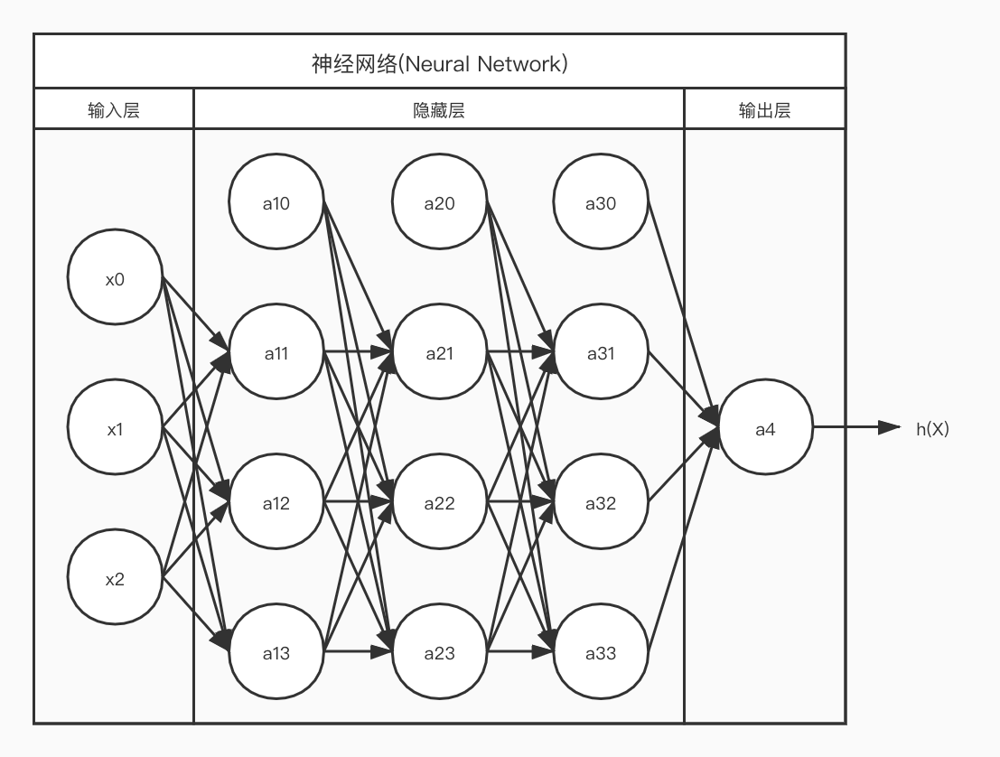

# 神经网络\(Neural Network\)

## 什么是神经网络

神经网络是一种尝试模仿人类大脑神经系统的算法, 它逐渐兴起于二十世纪八九十年代并受到广泛应用, 后续因为其偏大的计算量而沉寂过一段时间, 如今随着计算机运算能力的成长, 它再一次进入到我们的视野并且成为了一个十分有用的工具.

人类的大脑十分神奇, 它可以学习各种新的知识和技能. 和别的器官不一样, 人体的其他器官都存在具体的用途, 因此都在结构上进行了分化, 例如眼球能够感知光线, 肺部能够吸收氧气, 不过我们并不能通过眼球来呼吸, 也不能通过肺部来观察世界, 但是大脑可以!

科学家们在近代发现, 大脑不同部位会负责不同的工作, 这似乎意味着, "视觉"的脑区并不能替代"触觉"脑区, 我们的大脑里装着各种各样不同功能的脑区, 就像电脑里面运行着各种不同功能的程序一样. 

随后科学家们通过神经重接试验发现事实并非如此, 他们将视觉与触觉的感受器神经与脑区交换连接, 最终视觉脑区学会了"触觉", 触觉脑区学会了"视觉".

我们可以推断, 我们的大脑存在一种非常"高明"的认知机制, 这种认知机制能够模仿其他任何认知.我们推测, 这种认知机制是依靠无数个结构相对简单的神经元细胞间复杂的连接来实现的.

## 神经元

神经元是神经网络中的基础单位, 他主要包含了三个功能结构:

* 树突 - 接受神经电信号
* 细胞体 - 处理神经电信号
* 轴突 - 向另一个神经元传递神经电信号

## 神经网络能做什么

神经网络算法是通过模仿神经元以及神经元间复杂的连接来实现的. 不过遗憾地是, 因为计算机运算能力的制约, 神经网络算法目前并不能真正地模仿大脑, 但是它为我们很好地解决了高维度特征向量的多项组合过多的问题.

在现实中, 我们面对的往往是高纬度的特征向量X, 且特征值之间可能存在交叉影响, 假设我们对一个特征向量维度为10的问题进行线性回归, 并且目标函数的次数为1, 则:

$$
h(\vec{X}) = \theta_0 + \theta_1x_1 + ... + \theta_{10}x_{10}\\
+ \theta_{11}x_1x_2 + \theta_{12}x_1x_3 +  \theta_{13}x_1x_4\\
+ ... + \theta_{1024}x_1x_2x_3x_4x_5x_6x_7x_8x_9x_{10}
$$

仅仅特征向量维度n=10的线性回归问题, 当特征值之间存在交叉影响, 参数集合Θ的大小都会呈现几何级数增长, 对于任意n元a次函数而言, 参数集合Θ的大小为:

$$
(a+1)^n
$$

这种数量级, 使用单纯的梯度下降来求解损失函数最小化, 已经不是这个时代的计算机能够完成的任务了! 因此, 科学家们设计了神经网络来解决这个问题.

## 单元\(Unit\)

为了模仿人脑神经系统, 我们设计了神经网络的基本单位: **单元**, 使用字母U来表示. 通过单元复杂的连接, 以及单元本身对数据处理的能力, 共同组成了神经网络. 这种复杂的连接有效得表征了高维特征向量的多项组合. 根据单元的功能不同, 我们将单元分为以下两类单元:

### 逻辑单元\(Logic Unit\)

在神经网络中, 我们模仿神经元构建出了逻辑单元, 用字母LU来表示逻辑单元, 每个逻辑单元同样都包含了**三个部分**:

* 权重向量W - 类似于神经元的树突, 用于接收上一层逻辑单元的因变量向量Y, 也即是当前逻辑单元的自变量向量X, 并对其进行系数变换
* 激励函数s - 类似于神经元的细胞体, 用于处理自变量向量X并输出激励函数的因变量y
* 因变量y - 类似于神经元的轴突, 将作为下一层逻辑单元的自变量向量X的元素

上一层的因变量向量Y在传入激励函数s之前, 会经过一定的系数转换, 这些系数w被称为自变量x的**权重\(Weight\)**. 它和目标函数h的系数θ本质上是一样的, 都是函数的系数, 但是权重这个术语主要用于神经网络, 且他们在使用范围上存在区别. 

逻辑单元和神经元一样, 都是各自网络系统中的基本单位. 因此神经网络中存在多个逻辑单元, 每个逻辑单元都有自己的权重向量W, 通过自变量向量X和激励函数s计算出因变量y.

而神经网络, 也即是多个层次, 多个逻辑单元共同组合成了我们的目标函数h, 不能单纯地认为权重向量W等于目标函数h的系数向量Θ.

### 数字单元\(Number Unit\)

数字单元我们用字母NU表示, 其自身仅仅包含一个常数, 不包含权重向量W和激励函数s. 因为任何神经网络都有其初始输入, 即特征向量X, 每个数字单元都代表一个x. 数字单元还有一个特殊的**偏置单元\(Bias Unit\)**, 他们的值都恒定为1, 为下一层的输入提供了常量.

## 神经网络层次结构

神经网络仅仅是一个逻辑单元是不够的, 毕竟一个逻辑单元能做的事情, 线性回归和逻辑回归也能做到, 他们之间并没有什么本质的区别. 那神经网络的优势究竟在哪里?

神经网络真正的优势是在于其"无限可能"的层次结构. 多个逻辑单元互相连接互相影响. 就如同人类大脑一样, 神经网络的层次结构能够模拟和实现任何目标函数, 同时还能够兼顾性能, 这才是神经网络的最大优势.

上图是一个层次非常简单的神经网络, 每个圆圈都是一个单元, 并且包含了三层结构:

### 输入层Layer1

即特征向量X, 输入层固定有n+1个数字单元, x1, x2, ... , xn代表了n个特征值. x0为偏置单元, 代表了常量, 其值恒定为1. 每个神经网络有且仅有一个输入层.

### 隐藏层Layer2

每个神经网络都至少含有一层隐藏层, 每个隐藏层都含有多个逻辑单元和一个偏置单元, 逻辑单元接受输入层或者其他隐藏层的因变量向量Y, 作为自己的自变量向量X, 并向下一层的隐藏层或输入层输出因变量y.

### 输出层Layer3

输出层只有一个逻辑单元, 它最终输出的因变量y即为目标函数h的y.

### 层次嵌套

从神经网络多层次的结构我们可以看出, 神经网络事实上是一种嵌套结构, 一个层次深的神经网络可以拆分成多个小的神经网络, 任何一个输出层都可以视为另一个神经网络输入层的一个单元, 任何一个输入层都可以视为多个神经网络组合的输出层.

### 架构\(Architecture\)

神经网络的优势在于其可以任意变化的层数和每层的单元个数. 这种单元间复杂的连接影响称之为架构. 神经网络的架构是需要我们精心设计的, 一般来说, 神经网络的层数越高, 象征着目标函数h的次数越高, 每层的单元越多, 象征这目标函数多项式的组合越多.

## 一些约定

在神经网络范畴内, 有一些术语区别于线性回归和逻辑回归, 我们需要对这些术语进行约定:

### 层数

神经网络一般至少含有三个层次, 我们约定输入层的层数为0, 使用字母j来表示

### 序数

神经网络输入层和隐藏层都会有多个单元, 我们约定它们的第一个单元为偏置单元, 其序数为0, 使用字母i来表示序数.

### 权重

神经网络中, 每个逻辑单元都有各自的权重向量W, 因此第j层的第i个单元的权重向量W表示为:

$$
\vec{W}_i^{(j)} = 
\left [
\begin{matrix}
w_{i0}^{(j)} \\
w_{i1}^{(j)}\\
...\\ 
w_{in}^{(j)}
\end{matrix}
\right ]
$$

输入层并没有权重, 因此权重的j &gt; 0 . 同时因为每一层隐藏层的第一个单元为数字单元, 因此权重向量的i &gt; 0.

### 激励值

激励值即自变量向量X通过激励函数s计算后得到的数值, 和因变量y在意义上是等价的. 那为什么还要多余定义一个激励值呢? 这更多地是为了表述的方便, 因为因变量y的含义在很多范畴上都存在. 为了仅针对神经网络隐藏层中逻辑单元的激励函数s计算出的过程值, 我们定义了激励值, 并用a来表述, 并定义激励值向量A:

$$
\vec{A}^{(j)} = 
\left [
\begin{matrix}
a_0^{(j)}\\
a_1^{(j)}\\
...\\
a_n^{(j)}
\end{matrix}
\right ]\\

\vec{A}^{(0)} = \vec{X}\\
$$

需要注意的是, 神经网络每一层单元的个数都不是固定的, 也因此每个逻辑单元权重向量W的元素个数, 事实上取决于上一层单元的个数. 我们假设激励值向量A内元素的个数为n, 并不是代表不同层次的逻辑单元的权重个数相等, 也不代表权重个数与特征向量X的维度相等. 仅有第一层隐藏层的逻辑单元的权重向量W的元素个数与特征向量X的维度相关.

对于第一层隐藏层而言:

$$
a_i^{(1)} = s(\vec{W}_{i}^{(1)} \cdot \vec{A}^{(0)})
$$

$$
a_1^{(1)} = s(\vec{W}_{1}^{(1)} \cdot \vec{X})\\
= s(
w_{10}^{(1)}x_0 + 
w_{11}^{(1)}x_1 + 
w_{12}^{(1)}x_2 + 
... + 
w_{1n}^{(1)}x_n
)
$$

对于后续隐藏层而言:

$$
a_i^{(j)} = s(\vec{W}_{i}^{(j)} \cdot \vec{A}^{(j-1)})
$$

$$
a_1^{(2)} = s(\vec{W}_{1}^{(2)} \cdot \vec{A}^{(1)})\\
= s(
w_{10}^{(2)}a_0^{(1)} + 
w_{11}^{(2)}a_1^{(1)} +
w_{12}^{(2)}a_2^{(1)} +
... +
w_{1n}^{(2)}a_n^{(1)}
)
$$

## 神经网络的表示

神经网络的多层次架构可以通过向量的形式表达, 对于第j层的隐藏层而言, 若其中单元个数为i, 则权重矩阵W\(j\)为:

$$
\vec{W}^{(j)} = 
\left [
\begin{matrix}
(\vec{W}_1^{(1)})^T\\
(\vec{W}_2^{(1)})^T\\
...\\
(\vec{W}_i^{(1)})^T
\end{matrix}
\right ]\\
$$

$$
\vec{W}^{(j)} = 
\left [
\begin{matrix}
w_{10}^{(1)} & w_{11}^{(1)} & ... & w_{1n}^{(1)}\\
w_{20}^{(1)} & w_{21}^{(1)} & ... & w_{2n}^{(1)}\\
...\\
w_{i0}^{(1)} & w_{i1}^{(1)} & ... & w_{in}^{(1)}\\
\end{matrix}
\right ]\\
$$

由隐藏层激励值的通用公式可以得知:

$$
a_i^{(j)} = s(\vec{W}_{i}^{(j)} \cdot \vec{A}^{(j-1)})
$$

$$
\vec{A}^{(j)} = s(\vec{W}^{(j)} \cdot \vec{A}^{(j-1)} )
$$

$$
\vec{A}^{(j)} =
s(
\left [
\begin{matrix}
w_{10}^{(1)} & w_{11}^{(1)} & ... & w_{1n}^{(1)}\\
w_{20}^{(1)} & w_{21}^{(1)} & ... & w_{2n}^{(1)}\\
...\\
w_{i0}^{(1)} & w_{i1}^{(1)} & ... & w_{in}^{(1)}\\
\end{matrix}
\right ]
\left [
\begin{matrix}
a_0^{(j - 1)}\\
a_1^{(j -1)}\\
...\\
a_n^{(j -1)}
\end{matrix}
\right ]
)
$$

则我们可以将各个层次嵌套的目标函数h表达为:

$$
h(\vec{X}) = s(
\vec{W}^{(j+1)} \cdot
s(\vec{W}^{(j)} \cdot
s(\vec{W}^{(j -1)} \cdot
... \cdot
s(\vec{W}^{(1)} \cdot 
\vec{X}
)))
$$

需要注意的是, W\(j+1\)是输出层的权重向量.

