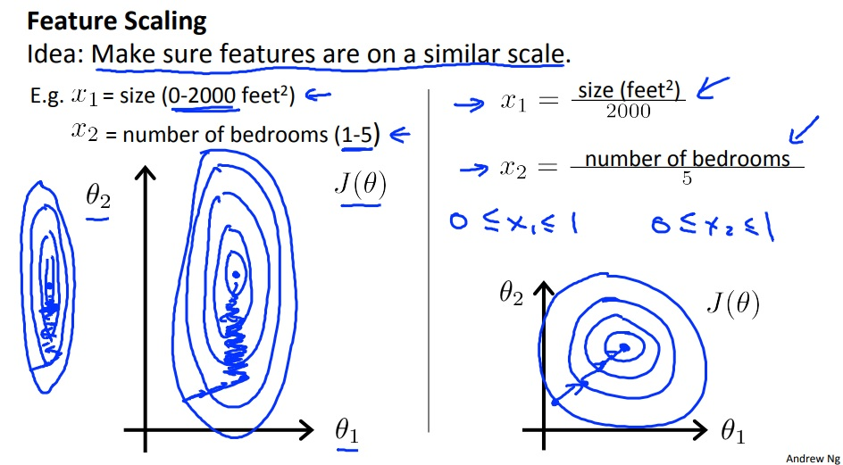

# 特征归一化 \(Feature Scaling\)

### 为什么要归一化

当我们在进行梯度下降时, 我们会发现在某些情况下, 我们需要循环很多次才能得到想要的结果. 原因是每一次梯度下降的循环后, 新的参数集Θ内总有很大一部分的参数并没有得到优化. 如果如果我们画出等值线图, 就会发现, 参数集的更新方向并不总是指向最低点, 而是存在一种"来回震荡"的现象.

并且这类情况都有一个显著的特点: X内的某些特征值的取值范围远大于另外一些特征值. 从梯度下降的公式来看:

$$
\theta_n := \theta_n - \alpha\frac{\partial}{\partial\theta_n}J(\Theta)
$$

x值会对θ的参数变化有不同程度的影响, 我们假设目标函数h为二元一次函数, 则他们的梯度下降算法为:

$$
\theta_0 :=\theta_0 - \alpha\frac{1}{m}\sum_{i=1}^m(h(X^{(i)}) - y^{(i)})\\
\theta_1 := \theta_1 - \alpha\frac{1}{m}\sum_{i=1}^m(h(X^{(i)}) - y^{(i)})x_1^{(i)}\\
\theta_2 := \theta_2 - \alpha\frac{1}{m}\sum_{i=1}^m(h(X^{(i)}) - y^{(i)})x_2^{(i)}
$$

由此可以看出, x可能的取值范围越大, 对应的θ变化也越大, 也越不容易指向最优的参数集Θ. 因此, 我们需要对特征值进行一定变换, 来减少特征值的取值范围对梯度下降的影响. 这种特征值处理方式叫做特征归一化.

### 如何归一化

特征归一化顾名思义, 就是让每个特征项可能的取值范围都尽量地落在一个很小的范围内, 这个范围以-3到+3之间为佳.

而进行归一化的方式有很多种:

#### 最大值归一

取每项特征中的最大值作为除数:

$$
\frac{x_n^{(i)}}{x_n^{(max)}}
$$

#### 均值归一

取每项特征的平均值与取值范围的除数:

$$
\frac{x_n^{(i)} - \mu_n}
{x_n^{(max)} - x_n^{(min)}}
$$

其中μn为每项特征的均值.

需要特别注意的是, 当我们获得参数集Θ后, 是不能直接将其代入目标函数h内的. 在此之间, 目标函数需要进行一次转换.

我们假设

